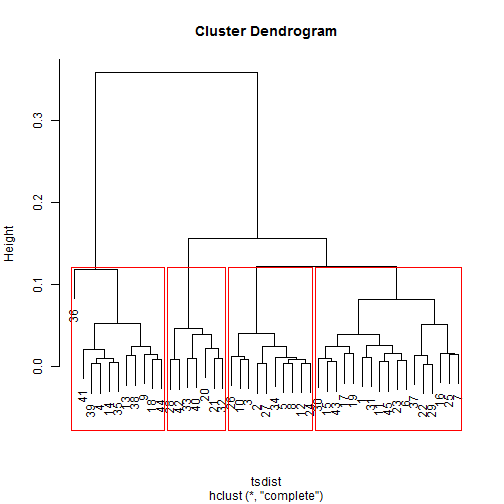
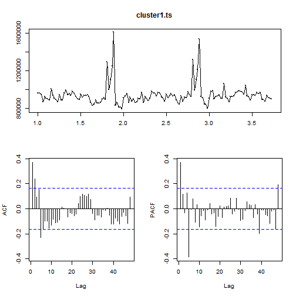
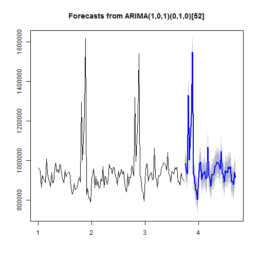
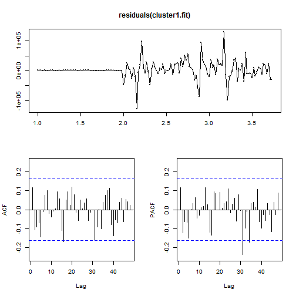

## Background

In 2014, Walmart held a Kaggle competition to challenge Kagglers to build an accurate prediction of future sales based on historical data.


I have chosen a scoped down version of this competition as my Springboard Capstone Project. If you would like to see the full details of the original Kaggle competition, please visit [this link](https://www.kaggle.com/c/walmart-recruiting-store-sales-forecasting).

## 1. Data Preparation

I begin with 2 data sets:

* __train.csv__: Historical training data from 5/2/2010 to 26/10/2011, containing columns for Store, Dept, Date, Weekly_Sales and IsHoliday
* __test.csv__: Test data for 2/11/2012 to 26/7/2013, containing columns for Store, Department, Date and IsHoliday


```r
# Snippet of train data
train
```

```
## Source: local data frame [421,570 x 5]
## 
##     Store   Dept       Date Weekly_Sales IsHoliday
##    (fctr) (fctr)     (date)        (dbl)     (lgl)
## 1       1      1 2010-02-05     24924.50     FALSE
## 2       1      1 2010-02-12     46039.49      TRUE
## 3       1      1 2010-02-19     41595.55     FALSE
## 4       1      1 2010-02-26     19403.54     FALSE
## 5       1      1 2010-03-05     21827.90     FALSE
## 6       1      1 2010-03-12     21043.39     FALSE
## 7       1      1 2010-03-19     22136.64     FALSE
## 8       1      1 2010-03-26     26229.21     FALSE
## 9       1      1 2010-04-02     57258.43     FALSE
## 10      1      1 2010-04-09     42960.91     FALSE
## ..    ...    ...        ...          ...       ...
```

```r
# Snippet of test data
test
```

```
## Source: local data frame [115,064 x 4]
## 
##     Store   Dept       Date IsHoliday
##    (fctr) (fctr)     (date)     (lgl)
## 1       1      1 2012-11-02     FALSE
## 2       1      1 2012-11-09     FALSE
## 3       1      1 2012-11-16     FALSE
## 4       1      1 2012-11-23      TRUE
## 5       1      1 2012-11-30     FALSE
## 6       1      1 2012-12-07     FALSE
## 7       1      1 2012-12-14     FALSE
## 8       1      1 2012-12-21     FALSE
## 9       1      1 2012-12-28      TRUE
## 10      1      1 2013-01-04     FALSE
## ..    ...    ...        ...       ...
```

A quick look through __train__ reveals that there are a total of 45 unique store numbers from 1 to 45. And, a total of 81 unique dept numbers from 1 to 99. This creates 3331 unique store-dept pairs. I.e. 3331 time-series, each with a frequency of 143 weeks, which roughly records 2+ years of sales data. 

My initial intention was to create an individual model for each time series. However, I soon found that this approach, which would require looped iterations of a 3331 x 3331 matrix, was too taxing for my computer. Therefore, my next step was to figure out how to scope the 3331 time series into managable clusters.

## 2. Time Series Clustering

Using the `reshape2` library,I reshaped my train data by stores. This created a 143 weeks x 45 store matrix. Each column represents the aggregated sales of all the departments within a store across 143 weeks.


```
## Source: local data frame [143 x 46]
## 
##          Date       1      10      11        12      13      14       15
##        (date)   (dbl)   (dbl)   (dbl)     (dbl)   (dbl)   (dbl)    (dbl)
## 1  2010-02-05 1643691 2193049 1528009 1100046.4 1967221 2623470 652122.4
## 2  2010-02-12 1641957 2176029 1574684 1117863.3 2030933 1704219 682447.1
## 3  2010-02-19 1611968 2113433 1503299 1095421.6 1970275 2204557 660838.8
## 4  2010-02-26 1409728 2006775 1336405 1048617.2 1817850 2095592 564883.2
## 5  2010-03-05 1554807 1987090 1426623 1077018.3 1939980 2237545 605325.4
## 6  2010-03-12 1439542 1941346 1331883  985594.2 1840687 2156035 604173.6
## 7  2010-03-19 1472516 1946875 1364207  972088.3 1879795 2066219 593710.7
## 8  2010-03-26 1404430 1893532 1245624  981615.8 1882096 2050396 592111.5
## 9  2010-04-02 1594968 2138652 1446210 1011822.3 2142482 2495631 718470.7
## 10 2010-04-09 1545419 2041069 1470308 1041238.9 1898321 2258781 634605.8
## ..        ...     ...     ...     ...       ...     ...     ...      ...
## Variables not shown: 16 (dbl), 17 (dbl), 18 (dbl), 19 (dbl), 2 (dbl), 20
##   (dbl), 21 (dbl), 22 (dbl), 23 (dbl), 24 (dbl), 25 (dbl), 26 (dbl), 27
##   (dbl), 28 (dbl), 29 (dbl), 3 (dbl), 30 (dbl), 31 (dbl), 32 (dbl), 33
##   (dbl), 34 (dbl), 35 (dbl), 36 (dbl), 37 (dbl), 38 (dbl), 39 (dbl), 4
##   (dbl), 40 (dbl), 41 (dbl), 42 (dbl), 43 (dbl), 44 (dbl), 45 (dbl), 5
##   (dbl), 6 (dbl), 7 (dbl), 8 (dbl), 9 (dbl)
```

Next, using the `TSclust` library, I applied an Autocorrelation (ACF) based dissimilarity calculation to my store matrix. This calculation performs a weighted Euclidean distance between 2 time-series, and the resulting output distance can be used as a measure for clustering.

My final output will be a pair-wise matrix of 45 x 45 stores. I run these distances through hierarchical clustering, and plot out the dendrogram. Upon visual inspection of the dendrogram, I decide to cluster the stores into 4 clusters.



## 3. ARIMA modeling
I now have 4 clusters represented as 4 time series. I approach my next step to forecast these time series, with the intention of using ARIMA modeling.

The ARIMA model is a combination of Autoregressive models (AR), Moving average models (MA) and can be extended to non-stationary time series through Integration(I). It's formula can be extended to include parameters to determine both trend and seasonal patterns.


A stationary time series is one whose properties do not depend on the time at which the series is observed. Before I began to build the ARIMA model, I first tested for stationarity using the Augmented Dickey-Fuller (ADF) test.


```r
#Test for stationarity by performing ADF test
adf.test(cluster1.ts, alternative='stationary')
```

```
## Warning in adf.test(cluster1.ts, alternative = "stationary"): p-value
## smaller than printed p-value
```

```
## 
## 	Augmented Dickey-Fuller Test
## 
## data:  cluster1.ts
## Dickey-Fuller = -5.279, Lag order = 5, p-value = 0.01
## alternative hypothesis: stationary
```

The results of the test suggest that this time series is stationary, and no differencing is required.

Next, to determine my coefficients for the AR and MA portion of my ARIMA model, I plot the autocorrelation function (ACF) and partial autocorrelation (PACF) for the time series. From the plot, the PACF and ACF lag orders whose values which cross the confidence boundaries, are candidates for the AR and MA coefficients respectively.



The ACF plot suggests lag order 1 and 2 are suitable candidates for the MA coefficient (q).
The PACF plot suggests lag order 1 and 5 are suitable candidates for the AR coefficient (p).

Additionally, this plot also shows that there is a clear seasonal pattern in my time series. As expected for retail sales data, there is a seasonal spike in sales in Q4 for each year. To account for this seasonality in my ARIMA model, I will apply a seasonal differencing for a period of 52 weeks. I.e. `seasonal(P, D, Q)` = `(0,1,0)[52]`

To make a final decision on which coefficients to use, I loop through my candidates to find the combination of p, d and q that will result in the lowest Akaike’s Information Criterion (AIC) score. AIC is a likelihood estimation on the measure of how accurate my ARIMA model fits with the data.


```r
Arima(cluster1.ts,order=c(1,0,1), seasonal = list(order = c(0,1,0), period = 52), include.mean = FALSE)
```

```
## Series: cluster1.ts 
## ARIMA(1,0,1)(0,1,0)[52]                    
## 
## Coefficients:
##          ar1      ma1
##       0.9733  -0.8749
## s.e.  0.0295   0.0627
## 
## sigma^2 estimated as 1.326e+09:  log likelihood=-1084.13
## AIC=2174.26   AICc=2174.54   BIC=2181.79
```


Using the `forecast` library, the model is then plotted as a forecast to show the expected sales for the next h=50 weeks. The dark and light shaded areas represent the 80% and 95% prediction intervals.




Once satisfied with this forecast, I repeat the steps listed in this section for each of my remaining clusters.

## 4. Evaluating forecast accuracy

To check the fit of my ARIMA models, I plot the ACF and PACF graph of the residuals.
If the residuals fall within the confidence boundaries, there is a good likelihood that the model is a a good fit.



Because this project is based on a Kaggle competition, the actual sales values of the test data set are not provided to me. This is quite inconvenient because I am unable to test the accuracy of my predictions locally. As a simple work-around, I will be splitting my train data set (143 weeks), into my own mini-train(120 weeks) and mini-test(23 weeks) data set for local testing.

As a metric for accuracy, I will be calculating the Mean Absolute Percentage Error (MAPE) of my predictions versus the actual test values. 


```
##   Cluster     MAPE
## 1       1 5.837927
## 2       2 5.824512
## 3       3 5.570019
## 4       4 6.833386
```


The MAPE is roughly 5-6%, which is satisfactory for a small, local test.

Finally, I generate predictions using the entire train data set. This will be condensed into a `csv` file to be uploaded to Kaggle. The Kaggle competition is over, but Kagglers can still test themselves by uploading their predictions to the Public Leader Board. For each submission, Kaggle will tell you what rank you would have placed had your submission came in during the valid competition period.

As a benchmark to the performance of my ARIMA model, I also submitted 2 other simple models:
* __Seasonal Naive__: A simple forecast that uses last year's sales for predicting next year's sales. Ie. this model predicts the future sales of 1 Jan 2013, to be identical to the sales value of 1 Jan 2012
* __Linear Regression Model__: Computes a forecast using linear regression and seasonal dummy variables

###Results

The Arima model performed the best of the 3 models, placing in the __65th place__ of Kaggle's public leaderboard. The seasonal naive and linear regression model came in at 168th and 216th place respectively.


## 5. Conclusion

Recap of this project:

1. I took Walmart's Kaggle competition data and cleaned, filtered and reshaped it into separate time series

2. I took a measure of the similarity of these time series to each other, and clustered them into 4 individual time series

3. For each time series, I applied exploration and analysis to fit an appropriate ARIMA model

4. I tested the accuracy of each ARIMA model against a small sample of local data, and the official test data provided on Kaggle

Problems encountered|Solution
--------------------|-----------------------------------------------------------------------
1. Dataset was too large to be computed on my system| Used time series clustering to scope down the size of the data in a way that minimizes confidence loss
2. I was unprepared for the technical complexity of clustering and modeling time series data accurately|Adopted a "Done is better than perfect" mentality, and constantly sought out advice on intelligent ways to scope my problem into something more managable
3. Actual test data was hidden behind Kaggle| Split my train data into smaller subsets of train and test data that could be used to measure accuracy on my local system

## 6. Acknowledgements

People:

1. Anirban Ghosh (Springboard mentor)

2. William TJVI

3. Peh Shu Ming

Resources:

1. [Forecasting: Principles and Practice](https://www.otexts.org/fpp/)

2. [The winning entry for the actual Kaggle competition](https://bitbucket.org/dthal/kaggle_walmart)

3. [Duke University's notes on ARIMA order selection](http://people.duke.edu/~rnau/arimrule.htm)

4. [A little book of R for time series](https://a-little-book-of-r-for-time-series.readthedocs.io/en/latest/)

5. [Time series clustering from AusDM R and Data Mining Workshop](http://www2.rdatamining.com/uploads/5/7/1/3/57136767/rdatamining-slides-time-series-analysis.pdf)
